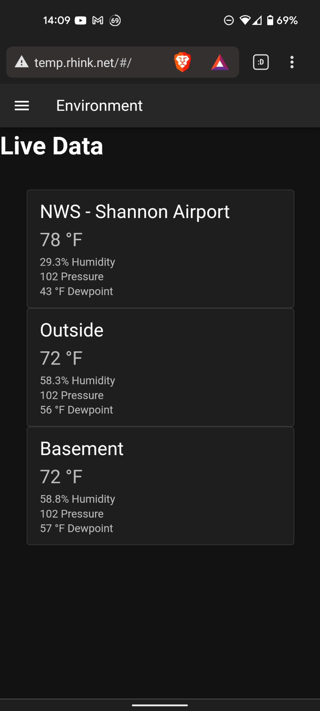

# Temperature Monitoring Project Description

## Project Repositories

- [Server](https://github.com/rhink256/temperature_server)
- [Client](https://github.com/rhink256/client)
- [Sensor](https://github.com/rhink256/arduino_sensor)
- [Compose](https://github.com/rhink256/Compose)
- [Server Container Image: Wildfly + Postgres Driver](https://github.com/rhink256/wildfly_with_postgres_driver)
- [Test Scripts](https://github.com/rhink256/Test-Scripts)
- [Jenkins - Docker](https://github.com/rhink256/Jenkins-Docker)

## Overview

A real-time logging temperature and humidity monitoring platform. It supports as many external sensors as you like, and can read data from local National Weather Service stations using their public [API](https://www.weather.gov/documentation/services-web-api).

The following image shows the client as rendered in a mobile web browser, with two sensors and one national weather service source.



This is a learning project I began to teach myself new techologies and platforms, and do something useful at the same time. Overall the project is not terribly complex but demonstrates the integration of a number of real world technologies. The intent is to create a product stack that would be suitable for real world use. The technologies and products used include:

- Docker
- Docker compose
- Docker networking
- Jenkins
- Nexus
- Vue 2
- VueX
- Vuetify
- Node.js
- Javascript
- Java
- Java Enterprise Edition
- Java Persistence API (JPA) / Hibernate
- Arduino Embedded Development (C++)
- Gradle
- REST API's (including using public APIs and creating my own)
- Javascript Object Notation (JSON)
- Wildfly/JBOSS
- H2 in memory database (for unit testing of database queries)
- Postgres

## Automation

It doesn't completely come across in the github version of the project as it is not integrated with my local infrastructure, but this product demonstrates complete build, test, and deployment automation using Jenkins and Docker. The Jenkinsfiles and Dockerfiles are visible, but to get this completely working you would need an instance of Jenkins, a maven artifact repository, and a docker repository, and Gitlab (or similar) with webhooks configured to trigger Jenkins builds. Further, Jenkins would need to be configured with user credentials for the maven and docker repositories.

## Components

### Client

The client is a Javascript based web front end built on top of the Vue framework. It uses VueX for state management and Vuetify for components. It communicates with the server via Websockets and REST.

It is served by Node.js running in a Docker container.

### Server

The server is built on Java Enterprise Edition. It uses Hibernate as its JPA provider. It communicates with the Client as described above. It runs on the Wildfly application server, running in a Docker container. The Docker container is customized with the postgres JDBC driver.

### Database

An unmodified postgres docker image, configured and run thusly: 
```
docker run \
    --name temperature_database_postgres \
    -p 192.168.1.207:5432:5432 \
    -e POSTGRES_PASSWORD=[PASSWORD] \
    -v temperature_database:/var/lib/postgres/data \
    --restart always \
    -d postgres
```

### Environmental Sensors

This can be anything sending the appropriate JSON to the appropriate REST endpoint. My implementation is the Arduino [MKR-WIFI-1010](https://store-usa.arduino.cc/products/arduino-mkr-wifi-1010?selectedStore=us) with the [MKR Env Shield](https://store.arduino.cc/collections/sensors-environment/products/arduino-mkr-env-shield-rev2). The implementation is optimized for battery life; with the board LED's removed it'll run for about 2 months with 3000 mAh Lithium Ion battery. It wakes up from deep sleep every 15 minutes, reads its sensors, transmits them to the server via WIFI, and goes back into deep sleep.

The server can handle input from any number of sensors; they are distinguished by their IP address.

## Development Environment

While you can certainly build this project with less, this is a learning project, and one of the learning aspects was to set up and configure a solid set of development tools. Replicating my environment means installing the following tools on a PC, preferably an always-on server with a decent bit of RAM (16 gigs minimum).

- Nexus
- Jenkins
- Gitlab
- Docker (server side)
- Docker Desktop (development PC)
- pihole (or other local DNS server)

The server is configured with multiple IP addresses to avoid port collisions. A pihole instance is configured with meaningful DNS names associated with these IP addresses.

Jenkins, Nexus, and Gitlab are launched with docker:

Jenkins:
```
docker run \
    --restart always \
    --name jenkins \
    --detach \
    -v /var/run/docker.sock:/var/run/docker.sock \
    -p [Jenkins IP]:80:8080 \
    -p [Jenkins IP]:50000:50000 \
    -v $(which docker):$(which docker) \
    -v jenkins_home:/var/jenkins_home \
    jenkins-docker
```

Then you'll need to configure pipelines for every project with a Jenkinsfile (once Gitlab is installed and configured). You'll also need to add Nexus credentials to the Jenkins credentials manager.

Note jenkins refers to jenkins-docker. See the repositories section for details; jenkins-docker modifies the base jenkins image slightly to enable running docker commands on the host (one of the possible solutions for docker-in-docker, i.e. a docker instance that can execute docker commands)

Gitlab:
```
docker run \
    --detach \
    --hostname gitlab.local  \
    --publish [Gitlab IP]:443:443 \
    --publish [Gitlab IP]:80:80  \
    --publish [Gitlab IP]:22:22 \
    --name gitlab \
    --restart always \
    --volume $GITLAB_HOME/config:/etc/gitlab \
    --volume $GITLAB_HOME/logs:/var/log/gitlab \
    --volume $GITLAB_HOME/data:/var/opt/gitlab \
    gitlab/gitlab-ce:latest
```

Then you'll of course need to copy all of these projects into Gitlab and configure Jenkins webhooks, if you want build automation.

Nexus:
```
docker run \
    --restart always \
    --detach \
    -p 192.168.1.204:80:8081 \
    -p 192.168.1.204:8080:8080 \
    --name nexus \
    -v nexus-data:/nexus-data \
    sonatype/nexus3:3.39.0
```

You will need to configure nexus with a maven and docker repository.

## Limitations

This project is a work in progress and not without warts. It is, after all, a spare-time self-education project. These include but are not limited to the following:

- some out of date dependencies
- no front end unit tests
- some missing backend unit test coverage
- no automated end to end tests
- no user management
- no authentication
- no security whatsoever
- hardcoded URL in the National Weather Service API client
- Naive websockets usage; no ability to reconnect if the websocket connection fails
- I think one of the docker files copies in a bunch of local files. It works but it's not clean.
